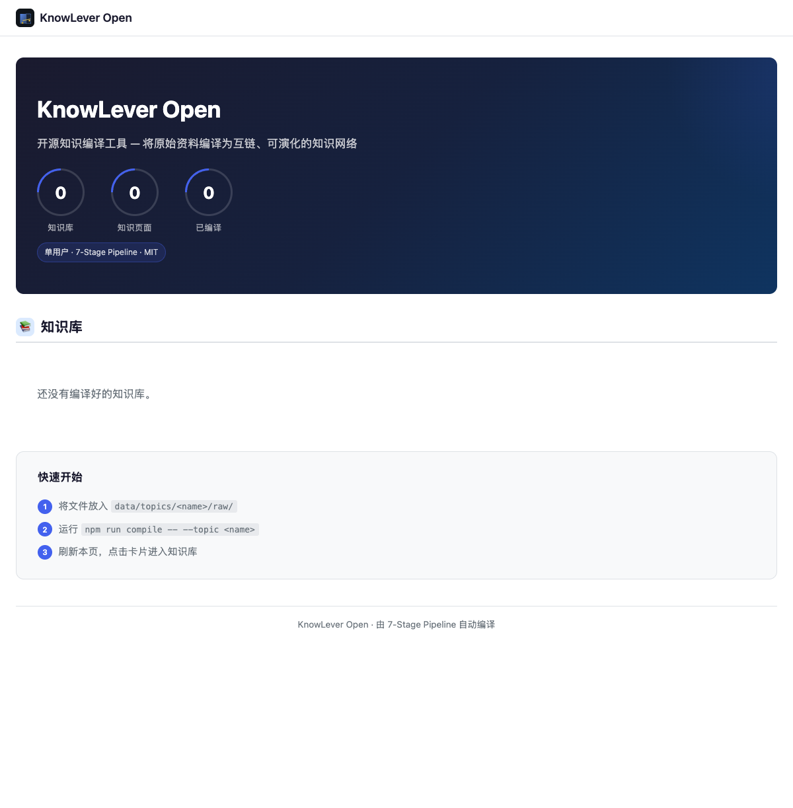

# KnowLever

**KnowLever**（原名 KnowLeverage）是面向 Agent 与文档工作流的知识 RAG 引擎——把散乱的 Markdown、PDF、Office 笔记**编译**成可浏览的结构化 Wiki，并通过语义检索为 PolarClaw、AutoOffice 等下游提供知识增强。

> 本仓库为 **开源简化版**（7 阶段编译管线 + 本地 Wiki 站点）；完整 RAG API、混合检索与多用户隔离见 [Polarisor 生态版 KnowLever](https://github.com/beichenO2/KnowLever)。

---

## 安装

### Polarisor 生态（完整能力）

适用于需要 RAG API、Chroma 向量库、Digest 同步、Skill 蒸馏的生产环境。

```bash
# 在 ECOSYSTEM_ROOT 下克隆
git clone https://github.com/beichenO2/KnowLever.git
git clone https://github.com/beichenO2/AutoOffice.git   # Office/PDF → Markdown
git clone https://github.com/beichenO2/PolarPrivate.git # LLM 代理

cd KnowLever
pip install -e .
npm install
bash Start/start.sh          # 启动 Wiki + RAG API（默认 :18080）
```

环境变量（可选）：

| 变量 | 用途 | 默认 |
|------|------|------|
| `ECOSYSTEM_ROOT` | 生态根目录 | 上级目录 |
| `KNOWLEVER_RAG_PERSIST` | Chroma 持久化路径 | `data/vector/default` |
| `KNOWLEVER_EMBEDDER_URL` | 嵌入服务 | `http://localhost:8801` |

健康检查：`http://127.0.0.1:18080/api/health`

### 独立安装（本仓库）

适用于个人开发者：命令行编译笔记 → 本地 Wiki 站点，无需完整生态。

**前置**：Node.js ≥ 18 · Python 3 · LLM 端点（OpenAI 兼容 HTTP 或 Polarisor LLM Proxy）

```bash
git clone https://github.com/beichenO2/KnowLever.git knowlever-open
cd knowlever-open
bash scripts/setup.sh
pip install -r requirements.txt   # Stage 2 聚类依赖
npm install
```

LLM 配置（`config.json` 或环境变量）：

| 配置 | 说明 |
|------|------|
| `LLM_BASE_URL` | 默认 `http://127.0.0.1:12790` |
| `LLM_API_KEY` | API Key（可填占位符） |
| `LLM_MODEL` | 编译用模型名 |

Office/PDF 转 Markdown 需额外安装 [AutoOffice](https://github.com/beichenO2/AutoOffice) 及本机 Pandoc / LibreOffice。

---

## 设计思考

### 为什么「编译」而不是直接向量检索？

原始文档质量参差、结构混乱，直接切块嵌入会导致检索噪声高、上下文断裂。KnowLever 先用 LLM 将素材**结晶**为带 frontmatter（summary / confidence / node_type）的结构化 Wiki，再索引与检索——精确定位与全局连贯性兼得。

### 为什么 per-topic 目录隔离，而不是单一全局库？

知识领域天然边界清晰（课程、项目、行业雷达等）。`data/topics/<topic>/` 或 `data/users/{user}/topics/<topic>/` 的布局避免跨域污染，支持独立编译、独立发布、独立 RAG 命名空间。

### 为什么静态 HTML 站点，而不是 MediaWiki / 动态 Wiki？

构建产物是纯 HTML/CSS/JS，**零运行时运维**，可 Git 版本管理、CDN 托管。一次编译，到处浏览；PolarMemory 等下游可直接消费 Wiki Markdown 资产。

### 为什么 BM25 + 向量 + RRF 混合检索，而不是纯向量？

向量搜索擅长语义改写，BM25 擅长精确术语与专有名词。Reciprocal Rank Fusion 融合两路排序，在 Polarisor 生产环境中经 `hybrid.py` 验证——比单路检索更稳。

---

## 核心亮点

| 维度 | 数据 |
|------|------|
| **7 阶段编译管线** | Ingest → Typed Normalize → Crystallize → Embed+Cluster → Tree → Page Compose → Link Validate → Site Build → PDF |
| **生产规模（生态版）** | 20 个 topic · **12,335** 篇 Wiki 页 · Chroma 向量库 **6.6 MB**（1024 维） |
| **嵌入模型** | `qwen3-embedding:8b`，1024 维，MTEB **70.6** |
| **开源示例 `radar-2026`** | 27 源 → **568** atoms → **52** clusters → **100** Wiki 页 → **442** HTML · 知识图谱 **60** 节点 / **273** 边 |
| **开源示例 `demo-parity`** | 3 篇公开 Markdown → **30** 页 HTML 站点 |
| **Stage 1 吞吐** | 单 chunk **50,000** 字 · overlap **2,000** 字（适配长上下文 LLM） |
| **Stage 2 聚类** | UMAP(10d) + HDBSCAN，无 LLM 依赖，纯 Python 离线运行 |
| **测试覆盖（生态版）** | **70+** pytest 用例（RAG 检索、Curated Contract、摄入管道） |
| **下游集成** | Node / Python SDK · AutoOffice RAG 增强 · PolarClaw Skill · PolarMemory Block 转换 |

---

## 页面预览

本地编译完成后，`npm run home` 打开知识门户：



Topic 站点首页（`radar-2026` 示例）：


---

## 架构

```
KnowLever_OpenSource/
├── wiki-engine/              # 7 阶段编译核心
│   ├── stage0_5-typed-normalize.js   # LLM 分流 → explanations/summaries/problems
│   ├── stage1-crystallize.js         # 知识原子结晶（emit_atoms）
│   ├── stage2-embed-cluster.py       # E000 嵌入 + UMAP + HDBSCAN
│   ├── stage3-tree-construct.js      # 递归语义分组 → 目录树
│   ├── stage4-page-compose.js        # Roll-up 生成 Wiki 页
│   ├── stage4_5-quiz-generate.js     # 练习题页
│   ├── stage5-link-validate.js       # 链接校验 + tech-decisions 审计
│   ├── stage6-site-build.js          # 静态 HTML + Cytoscape 知识图谱
│   ├── stage7-pdf-compose.js         # 打印友好 PDF 手册
│   └── tech-decisions.js             # 横切技术取舍记录
├── wiki-core/                # Markdown 渲染与 Wiki 配置（内置）
├── lib/
│   ├── llm-proxy.js          # LLM 统一访问（SOTAgent RPC → HTTP fallback）
│   ├── paths.js              # 路径解析 + 生态发现
│   ├── normalize-formulas.js # LaTeX 公式规范化
│   └── vlm-formula-ocr.js    # PDF/图片公式 OCR
├── normalize/                # 多格式摄入与语义增强
│   ├── deterministic/        # PDF/DOCX/PPT/视频/图片/OCR
│   └── semantic/             # enrich.py 语义富化
├── scripts/
│   ├── compile-7stage.js     # 全流程串联入口
│   ├── serve-home.js         # 本地门户 :4180
│   ├── office-import.js      # AutoOffice → raw/
│   └── setup.sh              # 首次环境检查
├── enhancement/              # 图谱构建、推理对比、检索增强
├── contracts/                # atom / tree / page JSON Schema
├── data/topics/<topic>/
│   ├── raw/                  # 原始输入（gitignore）
│   ├── normalized/           # 归一化 content.md（gitignore）
│   ├── wiki/                 # Wiki Markdown 知识资产（git track）
│   └── output/               # HTML 站点 + PDF（gitignore）
├── docs/                     # SETUP · WHAT_IS_THIS · PUBLISH
└── screenshots/              # README 预览图
```

**数据流**：

```
raw/*.md|pdf|docx  →  ingest/normalize  →  stage0.5-7  →  wiki/*.md  →  output/*.html
                                                              ↓
                                              （生态版）rag/index  →  Chroma  →  /api/search
```

---

## 快速开始

```bash
# 1. 克隆并初始化
git clone https://github.com/beichenO2/KnowLever.git
cd KnowLever
bash scripts/setup.sh && npm install && pip install -r requirements.txt

# 2. 编译内置示例（3 篇公开 Markdown）
npm run compile -- --topic demo-parity

# 3. 启动本地门户
npm run home
# → http://127.0.0.1:4180/

# 4. 编译自己的笔记
mkdir -p data/topics/my-notes/raw
cp ~/Documents/*.md data/topics/my-notes/raw/
npm run compile -- --topic my-notes
```

Office/PDF 先转 Markdown 再编译：

```bash
npm run office-import -- --from ./your-pdfs --topic my-course
npm run compile -- --topic my-course
```

常用命令：

| 命令 | 说明 |
|------|------|
| `npm run compile -- --topic <name>` | 完整 7 阶段编译 |
| `npm run compile:force` | 忽略增量缓存强制重编 |
| `npm run home` / `npm start` | 本地门户（:4180） |
| `npm run quality -- --topic <name>` | Wiki 质量评分 |
| `npm run export:pdf -- --topic <name>` | 导出 PDF 手册 |
| `npm run office-import` | AutoOffice 批量转 Markdown |

分阶段独立运行见 [`docs/SETUP.md`](docs/SETUP.md)。

---

## 生态依赖

| 组件 | 关系 | 用途 | 本仓库 |
|------|------|------|--------|
| **[PolarPrivate](https://github.com/beichenO2/PolarPrivate)** | LLM 代理 | 编译、结晶、页面撰写 | 可选（HTTP fallback） |
| **[AutoOffice](https://github.com/beichenO2/AutoOffice)** | 文档转换 | PDF/DOCX/PPTX → Markdown | Office 导入时需要 |
| **[SOTAgent](https://github.com/beichenO2/SOTAgent)** | 服务发现 | LLM RPC、端口注册、Funnel 公网暴露 | 生态版集成 |
| **wiki-core** | 内置模块 | Markdown → 静态 HTML | ✅ 已内置 |
| **[PolarClaw](https://github.com/beichenO2/PolarClaw)** | 消费方 | RAG Skill、知识检索 | 生态版 SDK |
| **[PolarMemory](https://github.com/beichenO2/PolarMemory)** | 消费方 | Wiki → Block 转换 | 生态版 |
| **digist** | 内容源 | Digest 条目 → curated 知识 | 生态版 |
| **Chroma** | 向量存储 | 1024 维语义索引 | 生态版 RAG |
| **Ollama / 嵌入服务** | 本地推理 | qwen3-embedding:8b | Stage 2 + 生态版 |

---

## 延伸阅读

- [这份开源包在干什么？](docs/WHAT_IS_THIS.md)
- [环境配置详解](docs/SETUP.md)
- [PolarSoul 设计哲学（wiki-core）](wiki-core/PolarSoul.md)
- 完整 RAG API 与 Skill 蒸馏：[GitHub — beichenO2/KnowLever](https://github.com/beichenO2/KnowLever)

---

## License

[MIT](LICENSE)
