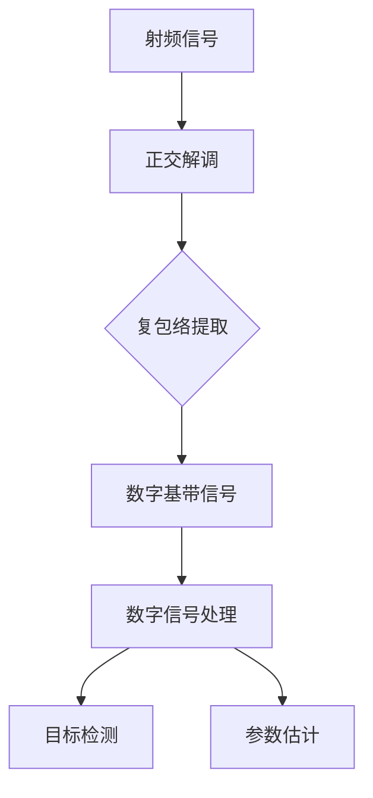

# 基带信号处理

## 定义
基带信号处理是雷达信号处理的核心环节，通过正交解调将高频射频信号转换为低频复基带信号。该过程包含两个关键步骤：1）将射频信号分解为同相（I路）和正交（Q路）双通道信号；2）通过复包络提取目标回波的幅度与相位信息。最终得到的复基带信号具有低频特性，便于后续的数字采样与处理。

基带信号处理的数学表达式为：
$$ z(t) = a(t)e^{j[2\pi f_0 t + \phi(t)]} = I(t) + jQ(t) $$
其中 $I(t)$ 和 $Q(t)$ 分别表示同相和正交分量，$a(t)$ 为幅度调制信号，$\phi(t)$ 为相位调制信号。

## 解决什么问题
基带信号处理解决了高频射频信号直接处理的三大困难：
1. **采样难题**：射频信号频率高达GHz级，常规ADC采样速率难以满足
2. **处理复杂度**：高频信号的实时处理需要极高计算资源
3. **信息丢失风险**：直接处理可能因带宽限制导致目标信息失真

通过基带转换，将信号频率降至MHz级，使数字信号处理成为可能。

## 工作原理
### 正交解调流程
1. **射频信号输入**：$x(t) = a(t)\cos[2\pi f_0 t + \phi(t)]$
2. **正交解调**：通过本地振荡器生成 $\cos(2\pi f_0 t)$ 和 $\sin(2\pi f_0 t)$ 信号
3. **混频处理**：
   - I路：$x(t)\cdot \cos(2\pi f_0 t)$
   - Q路：$x(t)\cdot \sin(2\pi f_0 t)$
4. **低通滤波**：提取基带信号 $a(t)\cos\phi(t)$ 和 $a(t)\sin\phi(t)$
5. **复包络构建**：$z(t) = I(t) + jQ(t)$

### 数学推导
射频信号的希尔伯特变换为：
$$ x^{\hat{}}(t) = \frac{1}{\pi t} * x(t) $$
复包络信号计算公式：
$$ z(t) = x(t) + jx^{\hat{}}(t) = a(t)e^{j[2\pi f_0 t + \phi(t)]} $$
通过 $z(t)e^{-j2\pi f_0 t}$ 得到基带信号：
$$ r(t) = a(t)e^{j\phi(t)} = I(t) + jQ(t) $$

### ASCII示意图
```
射频信号        ┌───────────────┐
                │ 正交解调 │
                └───┬───────┘
                   │
           I路信号 ──┐
                   │
           Q路信号 ──┘
                ┌───────────────┐
                │ 复包络构建 │
                └───────────────┘
               ↓
        复基带信号 z(t)
```

## 关键公式/方法
1. **正交解调公式**：
   $$ z(t) = x(t) + jx^{\hat{}}(t) $$
   其中 $x^{\hat{}}(t)$ 为希尔伯特变换
2. **基带信号表达式**：
   $$ r(t) = a(t)\cos\phi(t) + ja(t)\sin\phi(t) $$
   $I(t) = a(t)\cos\phi(t)$, $Q(t) = a(t)\sin\phi,phi(t)$
3. **复包络提取**：
   $$ z(t) = a(t)e^{j\phi(t)} $$
4. **信号恢复公式**：
   $$ x(t) = \frac{1}{2}[z(t)e^{j2\pi f_0 t} + z^*(t)e^{-j2\pi f_0 t}] $$

## 典型应用
以雷达信号处理为例：
- 射频信号：$x_T(t) = a(t)\cos[2\pi f_0 t + \phi_0]$
- 接收信号：$x_R(t) = ka(t)\cos[2\pi f_0 t + 2\pi f_d t + \phi_0]$
- 基带信号：$r(t) = a(t)\cos\phi(t) + ja(t)\sin\phi(t)$
- 通过基带信号提取目标幅度、速度等参数

## 与其他概念的对比
| 对比维度       | 基带信号处理                | MTI处理               | MTD处理               |
|----------------|-----------------------------|------------------------|------------------------|
| 处理对象       | 射频信号                    | 基带信号              | 基带信号              |
| 核心目标       | 降低采样率                  | 抑制固定目标杂波      | 提取多普勒频谱        |
| 数学基础       | 傅里叶变换/希尔伯特变换     | 差分运算              | 相参积累/FFT          |
| 信号特性       | 复信号                      | 实信号                | 复信号                |
| 应用阶段       | 信号转换阶段                | 慢时间域处理          | 慢时间域处理          |

## 常见误区
1. **误认为基带信号是实信号**：实际为复信号，包含幅度和相位信息
2. **混淆正交解调与普通解调**：正交解调需要双通道处理，而普通解调仅提取单路信号
3. **忽略复包络的物理意义**：复包络包含目标回波的完整信息，不能简单取实部
4. **误将基带处理等同于数字信号处理**：基带处理是数字信号处理的前提步骤

## 关联知识
- [[concept-radar-signal-processing]] 雷达信号处理的完整流程
- [[entity-quadrature-demodulation]] 正交解调的数学原理
- [[entity-cfar-processing]] 恒虚警处理与基带信号的关系
- [[concept-doppler-spectrum-analysis]] 多普勒频谱分析依赖基带信号

来源：`src-20260601-2026-9-雷达信号处理`

<div align="right" style="opacity: 0.5; font-size: 0.8em;">✨ <i>Compiled by MiniMax-M2.7-highspeed</i></div>


## 图示



> 基带信号处理流程：射频信号到数字处理的转换过程
