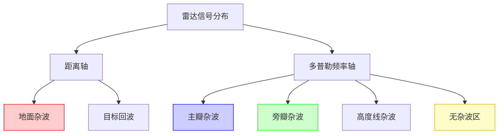

# 距离-多普勒空间

## 定义
距离-多普勒空间是雷达信号在距离维度（时间轴）和多普勒频率维度（速度轴）上的二维分布特性。该空间通过将回波信号分解为距离门和多普勒频率两个维度，实现对动目标与杂波的分离。在PD雷达中，距离门选通技术将回波信号按距离分段，而多普勒滤波器组则提取特定频率的信号，形成距离-多普勒二维平面。

该空间具有以下特征：
1. 每个距离门对应特定空间区域，形成距离轴
2. 每个多普勒频率对应特定运动状态，形成速度轴
3. 目标信号在空间中呈现独特的多普勒频移特性
4. 杂波（如主瓣、旁瓣、高度线杂波）在空间中呈现特定分布规律

## 解决什么问题
传统雷达在强杂波环境下难以区分动目标与背景噪声，距离-多普勒空间通过以下方式解决该问题：
1. 利用多普勒频移特性区分静止杂波与运动目标
2. 通过距离门选通技术消除非目标区域的杂波干扰
3. 在二维空间中实现动目标的精确定位与速度测量
4. 为多普勒滤波器组设计提供频谱分布依据

## 工作原理
### 二维分布机制
雷达回波信号在距离-多普勒空间中呈现以下分布特性：

```
          | 多普勒频率
          |------------------
          |  |  |  |  |  |
          |  |  |  |  |  |
          |  |  |  |  |  |
          |  |  |  |  |  |
          |  |  |  |  |  |
          |  |  |  |  |  |
          |------------------
          |  0  1  2  3  4  5
          | 距离门
```

- 每个距离门对应特定空间区域，形成距离轴
- 每个多普勒频率对应特定运动状态，形成速度轴
- 目标信号在空间中呈现独特的多普勒频移特性
- 杂波（如主瓣、旁瓣、高度线杂波）在空间中呈现特定分布规律

### 频谱分布分析
1. 主瓣杂波：频率分布范围Δf_MB ≈ 2vR/(λθ_B sinφ0)，强度最高
2. 旁瓣杂波：频率分布范围Δf_PB ≈ 2vR/λ，受天线参数影响
3. 高度线杂波：位于零多普勒频率位置，强度次之
4. 无杂波区：当PRF > fc_max时，目标信号落入无杂波区

## 关键公式/方法
### 多普勒频移计算
$$ f_d = \frac{2v_R}{\lambda} \cos \phi $$
- $f_d$：多普勒频移（Hz）
- $v_R$：雷达平台速度（m/s）
- $\lambda$：雷达波长（m）
- $\phi$：天线波束与地面夹角（rad）

### 主瓣杂波频率分布
$$ \Delta f_{MB} \approx \frac{2v_R}{\lambda \theta_B \sin \phi_0} $$
- $\theta_B$：波束主瓣宽度（rad）
- $\phi_0$：主波束轴线与地面夹角（rad）

### 无杂波区条件
$$ f_r > f_{c,max} $$
- $f_r$：脉冲重复频率（Hz）
- $f_{c,max}$：主瓣杂波最大展宽频率（Hz）

## 典型应用
### PRF选择示例
当某机载PD雷达工作波长λ=3cm，主波束宽度θ_B=3°，载机速度vR=680m/s，波束中心轴线与载机速度矢量夹角φ0=45°时：
1. 主瓣杂波中心频率：
   $$ f_{MB} = \frac{2\times 680}{0.03 \times \cos 45°} ≈ 32kHz $$
2. 主瓣杂波频率分布范围：
   $$ \Delta f_{MB} ≈ \frac{2\times 680}{0.03 \times 3° \times \sin 45°} ≈ 1.68kHz $$
3. 当PRF=200kHz时，目标落入无杂波区，检测能力最强

## 与其他概念的对比
| 概念 | 距离-多普勒空间 | 传统雷达二维空间 |
|------|----------------|------------------|
| 维度 | 距离+多普勒 | 距离+方位 |
| 特点 | 频谱分布分析 | 时域回波分析 |
| 应用 | 动目标检测 | 静目标定位 |
| 优势 | 分离速度与距离 | 简单直观 |
| 局限 | 需复杂信号处理 | 无法区分速度 |

## 常见误区
1. 将距离模糊与速度模糊混淆：高PRF导致距离模糊，低PRF导致速度模糊
2. 误认为高PRF总是更好：高PRF虽提升速度分辨，但会降低距离分辨
3. 忽视杂波分布规律：不同PRF模式下杂波重叠区不同
4. 错误理解无杂波区条件：需同时满足PRF > fc_max和目标位置

## 关联知识
- [[concept-pulse-doppler-radar]]：PD雷达系统架构与工作原理
- [[entity-prf]]：PRF参数对雷达性能的影响
- [[concept-motion-target-detection]]：运动目标检测技术原理
- [[concept-doppler-filter-bank]]：多普均滤波器组设计与应用

## 来源
资料来源：`2026-10-脉冲多普勒雷达.pdf`（AutoOffice to-markdown）

<div align="right" style="opacity: 0.5; font-size: 0.8em;">✨ <i>Compiled by MiniMax-M2.7-highspeed</i></div>


## 图示



> 距离-多普勒空间分布示意图：横轴为距离，纵轴为多普勒频率，标注不同杂波类型和无杂波区
