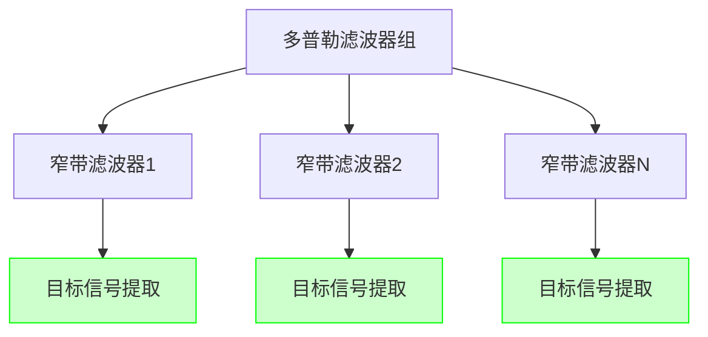

# 多普勒滤波器组

## 定义
多普勒滤波器组是由多个窄带滤波器构成的阵列系统，用于从回波信号频谱中提取特定多普勒频率的目标信号。该技术通过在频域选择性滤波，实现动目标与杂波的分离，是脉冲多普勒雷达实现速度分辨的核心模块。滤波器组需覆盖目标可能的多普勒频率范围，相邻滤波器交叠在3dB处，确保目标信号不会因频谱覆盖不足而丢失。

多普勒滤波器组的频谱响应设计需与目标回波谱匹配，通过窄带滤波器的通带宽度和形状控制，使接收机工作在最佳状态。其核心作用是将回波信号频谱中的目标信号与杂波分离开，为后续的动目标检测提供纯净的信号源。

## 解决什么问题
在强杂波背景下，传统雷达难以区分动目标与静止杂波。多普勒滤波器组通过频域选择性滤波，有效抑制地面杂波和高度线杂波，解决动目标检测中的速度模糊和杂波干扰问题。其核心价值在于实现目标速度分辨，同时保持对多普勒频率的精确控制。

## 工作原理
### 频谱选择机制
多普勒滤波器组通过以下步骤实现信号分离：
1. **频谱提取**：单边带滤波器输出回波信号的中心谱线，形成窄带信号
2. **频域选择**：多普勒滤波器组覆盖目标可能的多普勒频率范围（f_dmin~f_dmax）
3. **信号匹配**：每个滤波器对应特定多普勒频率（f_dTi），通过通带宽度和形状匹配目标回波谱
4. **输出处理**：滤波器组输出信号经检波和积累处理，提取目标信息

### 交叠设计
滤波器组采用交叠设计（相邻滤波器通带交叠3dB），确保目标多普勒频移不在滤波器交界处。当目标多普勒频移偏离滤波器中心频率时，信号功率会因频谱展宽而降低，但通过FFT算法处理可计算损失量。

### 典型流程
```
输入信号 → 单边带滤波 → 多普勒滤波器组 → 检波积累 → 目标检测
```

## 关键公式/方法
### 多普勒频移计算
$$ f_d = \frac{2v_R}{\lambda} \cos \phi $$
- $f_d$：多普勒频移（Hz）
- $v_R$：雷达平台速度（m/s）
- $\lambda$：波长（m）
- $\phi$：天线波束与地面夹角（rad）

### 滤波器组覆盖范围
$$ \Delta f_{FB} = f_{dmax} - f_{dmin} $$
- $f_{dmax}$：最大多普勒频率（Hz）
- $f_{dmin}$：最小多普勒频率（Hz）

### 交叠设计条件
$$ f_{dTi} = f_{center} \pm \frac{\Delta f_{FB}}{2N} $$
- $N$：滤波器数量
- $\Delta f_{FB}$：滤波器组覆盖范围（Hz）

## 典型应用
在PRF=200kHz的高PRF模式下，主瓣杂波最大展宽频率为45kHz。若目标多普勒频移为32kHz，需设计覆盖范围为20-40kHz的滤波器组。通过交叠设计，确保目标信号在滤波器组内，避免因频谱展宽导致的信号丢失。

## 与其他概念的对比
| 比较维度 | 多普勒滤波器组 | 单边带滤波器 | 主瓣杂波抑制滤波器 |
|---------|----------------|----------------|----------------------|
| 频率范围 | 覆盖目标多普勒范围 | 仅提取中心谱线 | 抑制主瓣杂波频率 |
| 交叠设计 | 交叠3dB | 无交叠 | 无交叠 |
| 信号处理 | 多频段选择 | 单频段提取 | 频谱平坦化 |
| 信噪比影响 | 降低信号功率 | 降低信号功率 | 降低杂波功率 |

## 常见误区
1. **滤波器组交叠不足**：导致目标信号因频谱展宽而丢失，需确保交叠设计
2. **忽略PRF影响**：不同PRF模式下目标多普勒频率范围不同，需动态调整滤波器组
3. **频谱匹配错误**：滤波器形状与目标回波谱不匹配，导致信号检测失败

## 关联知识
- [[concept-pulse-doppler-radar]]：PD雷达系统架构与工作原理
- [[concept-no-clutter-zone]]：无杂波区的形成条件与优化策略
- [[entity-prf]]：PRF参数对雷达性能的影响
- [[concept-motion-target-detection]]：运动目标检测技术原理

## 来源
资料来源：`2026-10-脉冲多普勒雷达.pdf`（AutoOffice to-markdown）

<div align="right" style="opacity: 0.5; font-size: 0.8em;">✨ <i>Compiled by MiniMax-M2.7-highspeed</i></div>


## 图示



> 多普勒滤波器组结构图：展示多个窄带滤波器如何协同提取目标信号
