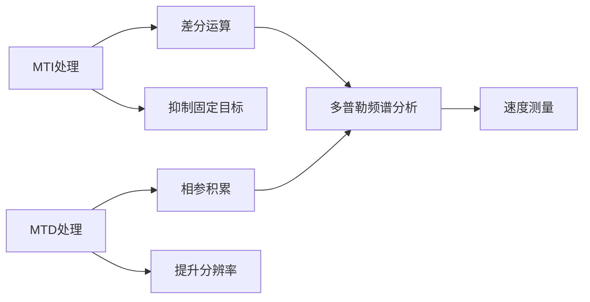

# 多普勒频谱分析

## 定义
多普勒频谱分析是雷达信号处理中用于测量目标速度的核心技术，通过MTD（动目标显示）处理实现多普勒频谱的提取与分析。该技术基于目标运动引起的多普勒频移特性，结合相参积累和FFT（快速傅里叶变换）算法，将时域信号转换为频域特征，从而实现对目标速度的精确测量。

多普勒频谱分析包含两个核心步骤：1）通过相参积累提升信噪比；2）利用FFT将离散多普勒频率转换为频谱分布。其输出结果为距离-速度二维分布图，可直接用于目标检测与参数估计。

## 解决什么问题
多普勒频谱分析解决了传统雷达系统中目标速度测量的难题。在复杂电磁环境中，固定目标杂波（如地面回波）会严重干扰运动目标检测。通过多普勒频谱分析，系统能够：

1. 区分静止目标与运动目标（多普勒频率为0的固定目标被抑制）
2. 提取运动目标的速度信息（通过多普勒频移计算）
3. 提高速度测量精度（相参积累提升信噪比）

## 工作原理
### 时域信号处理流程
1. **MTD处理前的数据**：存储N-K个距离单元的基带信号
2. **相参积累**：对每个距离单元进行加权求和，权重为e^{-j2πfd(n-1)T}
3. **FFT转换**：将离散多普勒频率序列转换为频谱分布

```
       N-K个
       权系数
       w(k+1) = e^{-j2πfd·0·T} = 1
       w(k+2) = e^{-j2πfd·1·T}
       w(k+3) = e^{-j2πfd·2·T}
       ...
       w(N) = e^{-j2πfd·(N-k-1)T}
```

### 频域分析
经过相参积累后的信号幅度P = (N-K)·cA，其中cA为单个距离单元的幅度。通过FFT运算，可得到离散多普勒频率序号i对应的幅度值P(i)，最终形成多普勒频谱图。

## 关键公式/方法
### 多普勒频率计算公式
$$ f_d = \frac{i}{N-K} \cdot PRF $$
- $ f_d $：目标多普勒频率（Hz）
- $ i $：离散多普勒频率序号（0~N-K-1）
- $ N-K $：对消后脉冲数
- $ PRF $：脉冲重复频率（1/T，单位Hz）

### 目标速度计算公式
$$ v = f_d \cdot \frac{\lambda}{2} $$
- $ v $：目标速度（m/s）
- $ \lambda $：电磁波波长（m）
- $ f_d $：多普勒频率（Hz）

### 距离计算公式
$$ R = n \cdot \Delta t \cdot \frac{c}{2} $$
- $ R $：目标距离（m）
- $ n $：距离单元序号
- $ \Delta t $：距离单元宽度（s）
- $ c $：光速（3×10⁸ m/s）

## 典型应用
### 雷达参数计算示例
某雷达参数：
- 脉冲重复周期 T = 100μs → PRF = 10kHz
- 距离单元数 N-K = 64
- 检测到第j=20个距离单元，第i=32个多普勒单元

计算：
1. 目标距离：R = 20×1μs×3×10⁸/2 = 3000m
2. 多普勒频率：fd = 32/64×10kHz = 5kHz
3. 目标速度：v = 5kHz×3×10⁻²/2 = 75m/s

## 与其他概念的对比
| 对比维度 | 多普勒频谱分析 | MTI处理 |
|---------|----------------|---------|
| 核心目标 | 目标速度测量 | 抑制固定目标杂波 |
| 技术手段 | 相参积累+FFT | 差分运算 |
| 输出结果 | 距离-速度分布 | 速度滤波信号 |
| 适用场景 | 运动目标检测 | 静止目标抑制 |

## 常见误区
1. **混淆多普勒频移与速度关系**：需注意波长λ对速度计算的影响
2. **忽略多普勒模糊**：当目标速度超过PRF/2时会出现速度测量错误
3. **误用FFT窗函数**：不同窗函数会影响频谱分辨率和旁瓣抑制效果

## 关联知识
- [[concept-baseband-signal-processing]] 基带信号处理为多普勒分析提供基础数据
- [[entity-cfar-processing]] 恒虚警处理依赖多普勒频谱分析结果
- [[concept-ambiguity-function-properties]] 模糊函数特性与多普勒频谱分析密切相关
- [[entity-prf]] 脉冲重复频率直接影响多普勒频谱分辨率

## 来源
来源：`src-20260601-2026-9-雷达信号处理`

<div align="right" style="opacity: 0.5; font-size: 0.8em;">✨ <i>Compiled by MiniMax-M2.7-highspeed</i></div>


## 图示



> 多普勒频谱分析对比：MTI与MTD处理方法的差异与关联
