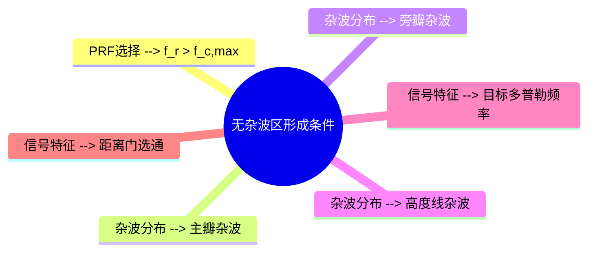

# 无杂波区

## 定义
无杂波区（No-Clutter Zone）是指在脉冲多普勒雷达系统中，通过优化脉冲重复频率（PRF）参数，使目标信号与杂波谱在频域上实现有效分离的特定区域。该区域内的信号功率谱密度显著低于杂波功率谱密度，为动目标检测提供了理想的信噪比环境。

在PD雷达中，无杂波区的形成依赖于PRF与杂波谱的频率分布关系。当PRF选择满足特定条件时，目标信号会落入该区域，而杂波谱则被限制在其他频段，从而实现信号与杂波的分离。这种频域分离机制是PD雷达克服传统雷达速度模糊和杂波干扰的核心技术之一。

## 解决什么问题
传统雷达在强杂波环境下（如地面或空中目标回波）难以区分有效信号与杂波，导致检测性能下降。无杂波区技术通过以下方式解决这一问题：
1. 通过PRF选择实现杂波谱与目标信号谱的频域分离
2. 为动目标检测提供纯净的信号环境
3. 提高雷达在复杂电磁环境下的目标识别能力
4. 降低虚假报警率，提升检测可靠性

## 工作原理
### 频域分离机制
无杂波区的形成基于PRF与杂波谱的频率分布关系。当PRF选择满足以下条件时，目标信号会落入无杂波区：
$$ f_r > f_{c,max} $$
其中：
- $ f_r $：脉冲重复频率（PRF）
- $ f_{c,max} $：主瓣杂波最大展宽频率

该条件确保目标信号的多普勒频率位于无杂波区，而杂波谱被限制在其他频段。具体实现过程如下：
1. 通过PRF选择控制杂波谱的分布范围
2. 利用窄带滤波器组提取特定频段信号
3. 在无杂波区进行目标信号检测

### 距离-多普勒空间特性
在距离-多普勒空间中，无杂波区表现为特定的频域区域。当PRF选择合适时，目标信号会出现在该区域，而杂波谱则被限制在其他频段。这种频域分离机制使得PD雷达能够在强杂波背景下实现动目标检测。

## 关键公式/方法
1. **无杂波区条件**：
   $$ f_r > f_{c,max} $$
   其中：
   - $ f_r $：脉冲重复频率（PRF）
   - $ f_{c,max} $：主瓣杂波最大展宽频率

2. **主瓣杂波最大展宽频率**：
   $$ f_{c,max} = \frac{2v_R}{\lambda} \cdot \frac{\theta_B}{2\sin \phi_0} $$
   其中：
   - $ v_R $：载机速度
   - $ \lambda $：雷达波长
   - $ \theta_B $：波束主瓣宽度
   - $ \phi_0 $：主波束轴线与地面夹角

3. **PRF选择原则**：
   - 高PRF模式（>200kHz）：形成较宽无杂波区，适合远距离目标检测
   - 中PRF模式（45-200kHz）：平衡距离与速度分辨率
   - 低PRF模式（<45kHz）：形成较窄无杂波区，适合近距离目标检测

## 典型应用
### 高PRF模式下的无杂波区应用
当PRF选择为200kHz时，主瓣杂波最大展宽频率$ f_{c,max} $约为45kHz。此时，若目标多普勒频率$ f_d $大于45kHz，则目标信号会落入无杂波区。例如：
- 载机速度$ v_R = 680m/s $，波长$ \lambda = 3cm $，主波束轴线与地面夹角$ \phi_0 = 45^\circ $，波束主瓣宽度$ \theta_B = 3^\circ $，则：
  $$ f_{c,max} = \frac{2\times 680}{0.03} \cdot \frac{3}{2\sin 45^\circ} \approx 45kHz $$
- 当目标速度$ v_T = 500m/s $，则多普勒频率$ f_d = \frac{2(v_R + v_T)}{\lambda} \cos \phi = \frac{2(680+500)}{0.03} \cos 45^\circ \approx 150kHz $，明显大于$ f_{c,max} $，目标信号落入无杂波区。

## 与其他概念的对比
| 比较维度       | 无杂波区                          | 距离门选通                  | 多普勒滤波器组             |
|----------------|----------------------------------|-----------------------------|-----------------------------|
| 工作原理       | 频域分离                         | 时域选择                    | 频域滤波                    |
| 适用场景       | 强杂波环境下的目标检测           | 距离分辨率优化              | 多普勒频率分辨              |
| 关键参数       | PRF选择                          | 距离门宽度                  | 滤波器带宽                  |
| 与杂波关系     | 信号与杂波频域分离               | 信号与杂波时间分离          | 信号与杂波频域分离          |
| 优势           | 提高信噪比，降低虚警率           | 提高距离分辨率              | 提高速度分辨率              |

## 常见误区
1. **误认为所有PRF模式都能形成无杂波区**：实际上只有当PRF > $ f_{c,max} $ 时才能形成无杂波区，不同PRF模式对应不同的无杂波区范围。
2. **忽略天线参数影响**：波束主瓣宽度和方向角会影响$ f_{c,max} $的计算结果，进而影响无杂波区的形成条件。
3. **混淆无杂波区与距离门选通**：两者虽然都用于信号处理，但无杂波区是频域分离技术，而距离门选通是时域选择技术。

## 关联知识
- [[concept-pulse-doppler-radar]]：PD雷达系统架构与工作原理
- [[concept-distance-doppler-space]]：距离-多普勒空间特性分析
- [[concept-doppler-filter-bank]]：多普勒滤波器组设计与应用
- [[entity-prf]]：PRF参数对雷达性能的影响

## 来源
来源：`2026-10-脉冲多普勒雷达.pdf`（AutoOffice to-markdown）

✨ <i>Compiled by MiniMax-M2.7-highspeed</i>

## 图示

> 无杂波区形成条件思维导图：展示PRF选择与杂波分布的关系
