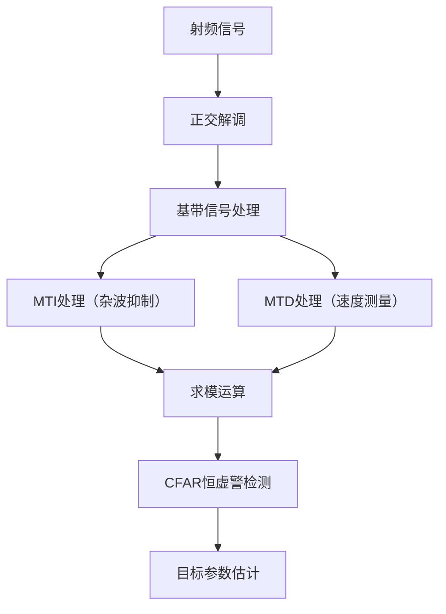

# 雷达信号处理

## 定义
雷达信号处理是将高频射频信号转换为低频基带信号，并通过多阶段数字信号处理实现目标检测与参数估计的技术流程。其核心包含四个关键环节：1）射频信号向基带信号的正交解调；2）多普勒频谱分析的MTI/MTD处理；3）目标幅度提取的求模运算；4）恒虚警检测的CFAR处理。该流程解决了高频信号直接处理的困难，实现了距离、速度、方位等目标参数的测量。

## 解决什么问题
雷达信号处理主要解决高频射频信号直接处理的三大困难：1）高频信号采样速率要求高（需达到GHz级别）；2）信号处理速度需求大（实时性要求）；3）固定目标杂波干扰（如地面杂波）。通过基带处理将信号频率降低至可处理范围，同时利用多普勒效应实现目标运动参数提取。

## 工作原理
### 射频→基带转换
射频信号 x(t) = a(t)cos[2πf₀t+φ(t)] 通过正交解调转换为复基带信号：
```
z(t) = a(t)e^{j[2πf₀t+φ(t)]} = I(t) + jQ(t)
```
其中 I(t)=a(t)cosφ(t) 为I路信号，Q(t)=a(t)sinφ(t) 为Q路信号。该过程通过希尔伯特变换实现，保留了信号的全部信息。

### 多普勒频谱分析
1. **MTI处理**：通过差分运算抑制固定目标杂波
```
y(n) = r(n) - r(n+1)
```
2. **MTD处理**：利用相参积累提升多普勒分辨率
```
P = (N-K)·cA  （cA为单次积累幅度）
```
3. **FFT频谱分析**：将N-K个离散频率值转换为多普勒频谱
```
fd = i/(N-K)·PRF  （PRF为脉冲重复频率）
```

### 目标检测
通过CFAR处理实现恒定虚警率：
```
R = 20×Δt×c/2  （Δt为距离单元宽度）
```
```
v = fd·λ/2  （λ为波长）
```

## 关键公式/方法
| 公式 | 含义 | 单位 |
|------|------|------|
| R = 20×Δt×c/2 | 目标距离计算 | m |
| fd = i/(N-K)·PRF | 多普勒频率计算 | Hz |
| v = fd·λ/2 | 目标速度计算 | m/s |
| P = (N-K)·cA | 相参积累幅度 | dB |
| y(n) = r(n) - r(n+1) | MTI差分运算 | 无量纲 |

## 典型应用
以某雷达参数为例：
- 脉冲重复周期 T=100μs
- 距离单元宽度 Δt=1μs
- 脉冲重复频率 PRF=10kHz
- 对消后脉冲数 N-K=64

当CFAR检测到第20个距离单元、第32个多普勒单元信号时：
```
R = 20×1μs×3×10⁸m/s/2 = 3000m
fd = 32/64×10kHz = 5kHz
v = 5kHz×3×10⁻²m/2 = 75m/s
```

## 与其他概念的对比
| 对比维度 | 雷达信号处理 | 脉冲多普勒雷达 |
|---------|-------------|----------------|
| 核心技术 | 基带处理、CFAR | 多普勒频移分析 |
| 处理目标 | 目标检测与参数估计 | 速度测量 |
| 信号类型 | 复基带信号 | 实信号 |
| 处理阶段 | 4阶段流程 | 3阶段流程 |

## 常见误区
1. **MTI与MTD混淆**：MTI仅抑制固定目标，MTD通过相参积累提升分辨率
2. **CFAR门限误解**：CFAR门限与背景噪声相关，非固定值
3. **多普勒模糊**：未考虑脉冲重复频率导致的多普勒频率混淆

## 关联知识
- [[concept-baseband-signal-processing]] 基带信号处理流程
- [[entity-quadrature-demodulation]] 正交解调原理
- [[concept-doppler-spectrum-analysis]] 多普勒频谱分析技术
- [[entity-cfar-processing]] 恒虚警处理算法
- [[concept-ambiguity-function-properties]] 模糊函数特性

来源：`src-20260601-2026-9-雷达信号处理`

<div align="right" style="opacity: 0.5; font-size: 0.8em;">✨ <i>Compiled by MiniMax-M2.7-highspeed</i></div>


## 图示



> 雷达信号处理全流程图：从射频信号到目标参数估计的处理步骤
