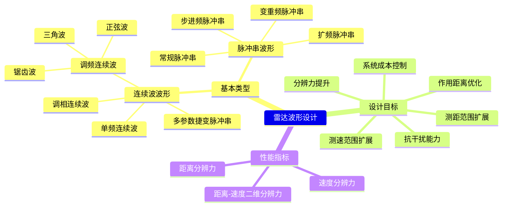

# 雷达波形设计

## 定义
雷达波形设计是通过优化发射信号的时域和频域特性，使雷达系统在距离分辨力、速度分辨力和抗干扰能力等方面达到最优平衡的技术方法。其核心目标是通过调整信号参数（如脉冲宽度、带宽、调频斜率等），使模糊函数的主瓣宽度和旁瓣特性满足特定应用场景需求。波形设计需综合考虑信号能量、脉冲重复频率、带宽等参数的约束条件。

## 解决什么问题
雷达波形设计主要解决以下核心矛盾：
1. 距离分辨力与作用距离的平衡：宽带信号提升分辨力但降低作用距离
2. 速度分辨力与信号能量的权衡：长脉冲提高速度分辨力但降低信号能量
3. 抗干扰能力与信号复杂度的矛盾：高复杂度信号易受干扰但难以处理
4. 多目标分辨与单目标检测的冲突：高分辨力可能导致目标混淆

## 工作原理
### 数学建模
雷达波形设计基于模糊函数理论，通过调整信号参数改变模糊函数的形状。典型设计流程如下：

1. **信号建模**：定义信号复包络 $u(t)$，如恒载频脉冲 $u(t) = \text{rect}(t/T)$ 或线性调频信号 $u(t) = e^{j\pi \Delta f t^2}$
2. **模糊函数计算**：
   $$\chi(\tau, f_d) = \int_{-\infty}^{\infty} u(t)u^*(t+\tau)e^{j2\pi f_d t} dt$$
3. **性能评估**：通过分析模糊函数主瓣宽度、旁瓣电平、模糊体积等参数，量化距离/速度分辨力
4. **参数优化**：调整带宽 $B$、脉冲宽度 $T$、调频斜率 $\Delta f$ 等参数，使模糊函数满足设计指标

### 关键机制
- **距离分辨力**：由模糊函数主瓣宽度决定，$\Delta R = c/(2B)$
- **速度分辨力**：由模糊函数频谱宽度决定，$\Delta v = f_d/(2T)$
- **模糊体积不变性**：$\iint |\chi(\tau, f_d)|^2 d\tau df_d = E^2$（信号能量平方）

## 关键公式/方法
### 基础公式
1. **距离模糊函数**：
   $$\chi(\tau) = \int u(t)u^*(t+\tau) dt$$
   *参数*：$\tau$ 为时延，单位 s

2. **速度模糊函数**：
   $$\chi(f_d) = \int u(t)u^*(t)e^{j2\pi f_d t} dt$$
   *参数*：$f_d$ 为多普勒频移，单位 Hz

3. **延时分辨常数**：
   $$A_\tau = \frac{\int |\chi(\tau)|^2 d\tau}{\chi^2(0)}$$

4. **多普勒分辨常数**：
   $$A_{fd} = \frac{\int |\chi(f_d)|^2 df_d}{\chi^2(0)}$$

### 优化方法
1. **带宽-时宽平衡**：$B \cdot T = 2\Delta f T^2$（线性调频信号）
2. **旁瓣抑制技术**：通过相位编码（如巴克码）降低模糊函数旁瓣电平
3. **多参数捷变**：结合调频、调相、调幅等技术实现动态波形调整

## 典型应用
### 恒载频矩形脉冲设计
- **参数**：脉冲宽度 $T = 1\mu s$，载频 $f_c = 1GHz$，功率 $P = 100W$
- **性能**：
  - 距离分辨力：$\Delta R = c/(2B) = 300m$
  - 速度分辨力：$\Delta v = f_d/(2T) = 150m/s$
- **模糊函数**：刀刃型，距离模糊函数为线性衰减，速度模糊函数为矩形脉冲

### 线性调频信号设计
- **参数**：调频斜率 $\Delta f = 100MHz/\mu s$，脉冲宽度 $T = 1\mu s$
- **性能**：
  - 距离分辨力：$\Delta R = 150m$
  - 速度分辨力：$\Delta v = 150m/s$
- **模糊函数**：锥形，具有距离-速度二维分辨能力

## 与其他概念的对比
| 维度 | 雷达波形设计 | 模糊函数 | 多普勒滤波器组 |
|------|-------------|----------|------------------|
| 核心目标 | 优化信号参数 | 分析分辨能力 | 实现速度分离 |
| 数学基础 | 模糊函数理论 | 模糊函数 | 多普勒频移原理 |
| 应用场景 | 波形优化设计 | 性能评估 | 目标速度检测 |
| 关键参数 | 带宽、时宽 | 主瓣宽度 | 滤波器带宽 |

## 常见误区
1. **混淆分辨力与作用距离**：宽带信号提升分辨力但降低作用距离，需通过增益补偿
2. **忽略模糊体积约束**：设计时需确保模糊函数体积满足 $\iint |\chi(\tau, f_d)|^2 d\tau df_d = E^2$ 的物理限制
3. **过度追求高分辨力**：可能导致目标混淆，需结合模糊度图分析

## 关联知识
- [[concept-ambiguity-function]]（模糊函数定义与性质）
- [[entity-doppler-shift]]（多普勒频移原理）
- [[concept-distance-resolution]]（距离分辨力计算）
- [[concept-doppler-resolution]]（速度分辨力计算）
- [[synthesis-雷达信号处理总览]]（信号处理系统架构）

## 待探讨
1. 如何量化评估不同波形在复杂电磁环境下的抗干扰性能？
2. 模糊函数的轴切割特性在工程实现中的具体应用边界
3. 高距离分辨力与高速度分辨力的权衡优化方法

来源：`2026-8-模糊函数及雷达波形设计.pdf`（AutoOffice to-markdown）

✨ <i>Compiled by MiniMax-M2.7-highspeed</i>

## 图示

> 雷达波形设计的层次化知识结构图
