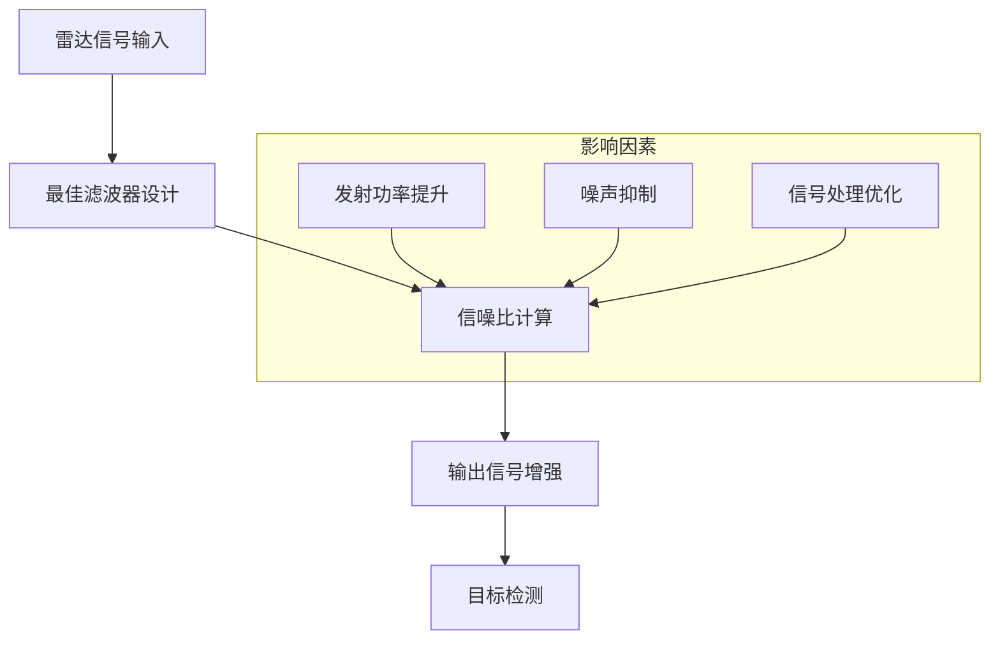

# 信噪比最大化

## 定义
信噪比最大化（SNR Maximization）是雷达信号处理领域的核心优化目标，指通过滤波器设计使输出信号与噪声功率比达到最大值。该原理基于许瓦兹不等式推导，通过匹配滤波器设计使信号在特定时刻的信噪比达到理论最大值。其数学本质是优化信号能量与噪声功率的比值，最终实现目标检测能力的提升。

信噪比最大化与传统信号不失真准则存在本质差异，它以统计特性优化为目标，而非追求信号波形的精确还原。这种优化策略在雷达系统中具有重要应用价值，特别是在噪声环境中提升目标检测概率。

## 解决什么问题
在雷达系统中，信号淹没在噪声中是普遍存在的技术难题。信噪比最大化通过以下方式解决该问题：
1. 提升信号能量与噪声功率的比值
2. 优化滤波器频率响应特性
3. 实现信号与噪声的统计特性分离
4. 最大化检测概率与最小化虚警概率的平衡

该方法直接针对雷达信号检测的核心矛盾——信号弱、噪声强，通过数学优化手段实现检测性能的突破。

## 工作原理
### 数学推导
设输入信号为x(t)=s(t)+n(t)，其中s(t)为有用信号，n(t)为白噪声。通过设计滤波器h(t)，使输出信号y(t)=s0(t)+n0(t)的信噪比达到最大。

根据许瓦兹不等式：
$$\frac{\left|\int s(t)h(t)dt\right|}{\sqrt{\int |h(t)|^2 dt \cdot \int |n(t)|^2 dt}}$$

推导得到最优滤波器频率响应：
$$H(\omega) = C \cdot S^*(\omega) e^{-j\omega t_0}$$

其中C为常数，t0为时间延迟参数，S(ω)为信号频谱。该公式表明，滤波器频率响应应与信号频谱共轭对称，以实现信噪比最大化。

### 实现机制
1. **频域匹配**：滤波器幅频特性与信号幅频特性一致
2. **相位补偿**：相频特性与信号相频特性相反
3. **时间对齐**：通过时间延迟t0使信号能量在特定时刻集中

这种设计使信号能量在输出端获得最大增益，同时抑制噪声成分。其物理实现通过匹配滤波器完成，具体表现为冲激响应h(t)=C·s*(t0-t)。

## 关键公式/方法
### 1. 信噪比计算公式
$$\frac{S}{N} = \frac{2E}{N_0 \cdot \Delta f}$$
- E：信号能量（单位：J）
- N0：噪声功率谱密度（单位：W/Hz）
- Δf：带宽（单位：Hz）

### 2. 匹配滤波器频率响应
$$H(\omega) = C \cdot S^*(\omega) e^{-j\omega t_0}$$
- S*(ω)：信号频谱的共轭
- t0：时间延迟参数（单位：s）
- C：增益常数

### 3. 冲激响应公式
$$h(t) = C \cdot s^*(t_0 - t)$$
- s*(t0-t)：信号的共轭时间反转
- t0：时间延迟（单位：s）

## 典型应用
### 雷达信号处理示例
在雷达系统中，假设目标回波信号s(t)为矩形脉冲，幅度A，持续时间τ。通过设计匹配滤波器，使输出信噪比达到最大：

1. 信号能量E = A²τ
2. 噪声功率谱密度N0 = 1 W/Hz
3. 带宽Δf = 1/τ

计算得到最大信噪比：
$$\frac{S}{N} = \frac{2A²τ}{1 \cdot (1/τ)} = 2A²τ²$$

该结果表明，通过匹配滤波器设计，信噪比与信号能量平方成正比，与带宽成反比。

## 与其他概念的对比
| 比较维度 | 信噪比最大化 | 传统滤波 | 相关接收 |
|---------|-------------|----------|----------|
| 优化目标 | 信噪比最大化 | 信号不失真 | 相关性差异 |
| 实现方式 | 匹配滤波器 | 通用滤波器 | 相关运算 |
| 适用场景 | 噪声环境检测 | 信号波形还原 | 信号相关分析 |
| 数学基础 | 许瓦兹不等式 | 线性系统理论 | 相关函数理论 |

## 常见误区
1. **误认为信噪比最大化是唯一优化目标**：实际应用中需综合考虑检测概率、虚警概率等指标
2. **忽略噪声特性差异**：不同噪声类型（如高斯噪声、脉冲噪声）需采用不同优化策略
3. **混淆匹配滤波器与相关接收器**：二者在统计特性上等效，但实现方式存在差异

## 关联知识
- [[concept-optimal-filtering]] 最佳滤波理论
- [[entity-matched-filter]] 匹配滤波器设计
- [[concept-cross-correlation]] 相关接收技术
- [[concept-neyman-pearson]] 检测性能优化准则
- [[concept-ambiguity-function]] 模糊函数特性分析

## 来源
> 来源：`2026-9-雷达信号检测.pdf`

✨ <i>Compiled by MiniMax-M2.7-highspeed</i>

## 图示

> 信噪比最大化处理流程
