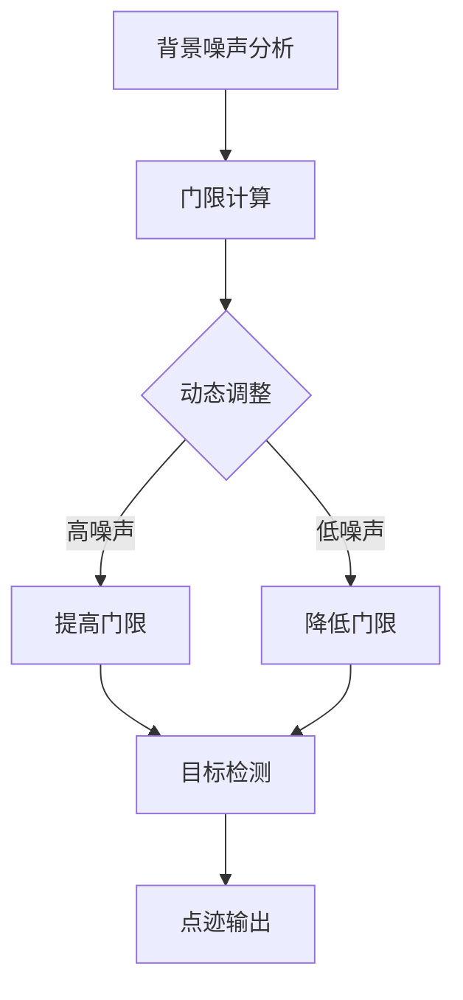

# 恒虚警检测

## 定义
恒虚警检测（Constant False Alarm Rate, CFAR）是一种雷达信号处理技术，通过动态调整检测门限，使系统在不同噪声环境下保持恒定的虚警率。该技术广泛应用于雷达目标检测中，确保在背景噪声波动时仍能维持稳定的检测性能。

CFAR处理的核心思想是根据周围环境噪声水平自动调整检测阈值，使目标检测概率与虚警率保持平衡。其数学本质是通过统计噪声特性计算门限值，避免固定门限导致的虚警率波动。

## 解决什么问题

传统固定门限检测方法在噪声强度变化时会导致虚警率显著波动：
1. 噪声强度增大时，目标可能被误判为噪声（虚警增加）
2. 噪声强度减小时，真实目标可能被漏检（漏检率增加）

CFAR技术通过动态调整门限，解决了以下核心问题：
- 保持恒定虚警率（False Alarm Rate）
- 适应不同噪声环境下的目标检测需求
- 提高目标检测的可靠性与稳定性

## 工作原理
### 处理流程
CFAR处理包含以下关键步骤：
1. **背景噪声估计**：分析参考单元的噪声特性
2. **门限计算**：根据噪声估计值计算检测门限
3. **目标检测**：比较目标单元与门限值进行判决
4. **输出结果**：生成目标点迹数据包

### 动态门限调整机制
CFAR采用统计方法计算门限值，典型公式为：
$$
\text{Threshold} = \text{Noise Estimate} \times \text{CFAR Factor}
$$
其中：
- Noise Estimate：参考单元的噪声估计值（单位：dB）
- CFAR Factor：门限因子（通常为1-3之间）

### 多普勒频率与目标参数计算
在雷达系统中，CFAR处理后可计算目标参数：
- **目标距离**：$ R = \frac{\text{距离单元数} \times \text{脉冲宽度} \times c}{2} $（单位：米）
- **多普勒频率**：$ f_d = \frac{i}{N-K} \times PRF $（单位：Hz）
- **目标速度**：$ v = \frac{f_d \times \lambda}{2} $（单位：m/s）

## 关键公式/方法
### 1. 门限计算公式
$$
\text{Threshold} = \text{Noise Estimate} \times \text{CFAR Factor}
$$
- Noise Estimate：参考单元的噪声估计值（dB）
- CFAR Factor：门限因子（通常为1-3）

### 2. 目标距离计算
$$
R = \frac{\text{距离单元数} \times \text{脉冲宽度} \times c}{2}
$$
- 距离单元数：检测到的离散多普勒序号（如20）
- 脉冲宽度：$ \tau = 1\mu s $（单位：秒）
- 光速：$ c = 3\times10^8 m/s $

### 3. 多普均频率计算
$$
 f_d = \frac{i}{N-K} \times PRF
$$
- i：离散多普勒序号（如32）
- N-K：对消后脉冲数（如64）
- PRF：脉冲重复频率（如10kHz）

### 4. 目标速度计算
$$
 v = \frac{f_d \times \lambda}{2}
$$
- $ \lambda = \frac{c}{f_0} $：波长（单位：米）
- $ f_0 = 10GHz $：载频

## 典型应用
### 雷达参数示例
某雷达系统参数如下：
- 脉冲重复周期：$ T = 100\mu s $
- 距离单元宽度：$ \Delta t = \tau = 1\mu s $
- 载频：$ f_0 = 10GHz $
- CFAR处理后检测到：
  - 距离单元数：20
  - 离散多普勒序号：32
  - 对消后脉冲数：64

计算结果：
- 目标距离：$ R = \frac{20 \times 1\mu s \times 3\times10^8}{2} = 3000m $
- 多普勒频率：$ f_d = \frac{32}{64} \times 10kHz = 5kHz $
- 目标速度：$ v = \frac{5kHz \times 3\times10^{-2}}{2} = 75m/s $

## 与其他概念的对比
| 比较维度 | CFAR处理 | MTI处理 | MTD处理 |
|---------|---------|--------|--------|
| 处理目标 | 保持恒定虚警率 | 抑制固定目标杂波 | 多普勒频谱分析 |
| 适用场景 | 多种噪声环境 | 静止目标干扰 | 运动目标检测 |
| 处理方式 | 动态门限调整 | 差分运算 | 相参积累 |
| 输出结果 | 目标点迹数据包 | 消除杂波信号 | 多普勒频谱图 |

## 常见误区
1. **误认为CFAR能消除所有杂波**：CFAR仅保持恒定虚警率，不能完全消除杂波
2. **固定门限导致虚警波动**：未使用CFAR时，噪声变化会导致虚警率显著波动
3. **忽略多普勒模糊现象**：在高速目标检测中需注意多普勒频率折叠问题

## 关联知识
- [[concept-radar-signal-processing]] 雷达信号处理的核心流程
- [[entity-cfar-processing]] 恒虚警处理算法原理
- [[concept-doppler-spectrum-analysis]] 多普勒频谱分析技术
- [[concept-baseband-signal-processing]] 基带信号处理流程

来源：`src-20260601-2026-9-雷达信号处理`

✨ <i>Compiled by MiniMax-M2.7-highspeed</i>

## 图示

> 恒虚警检测流程：基于背景噪声的动态门限调整机制
